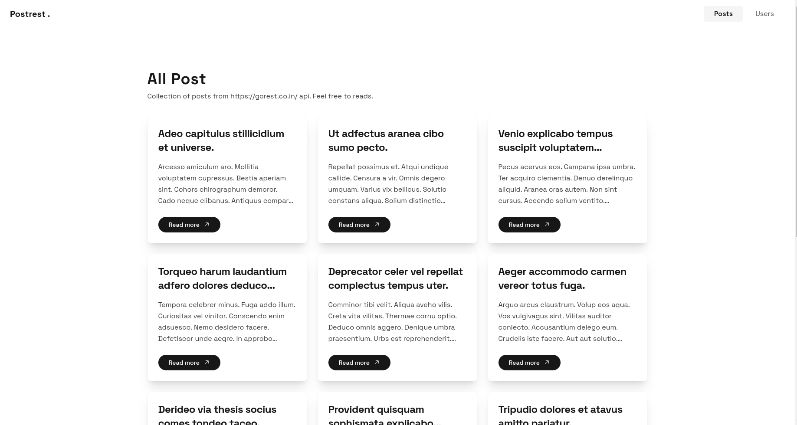
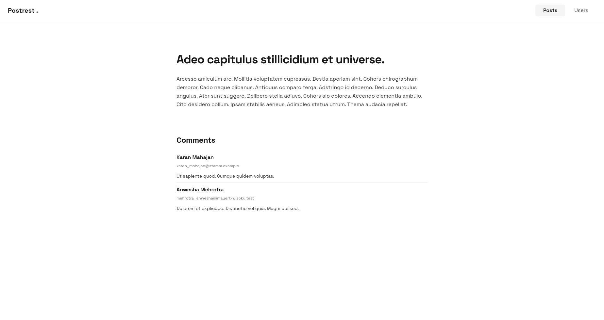
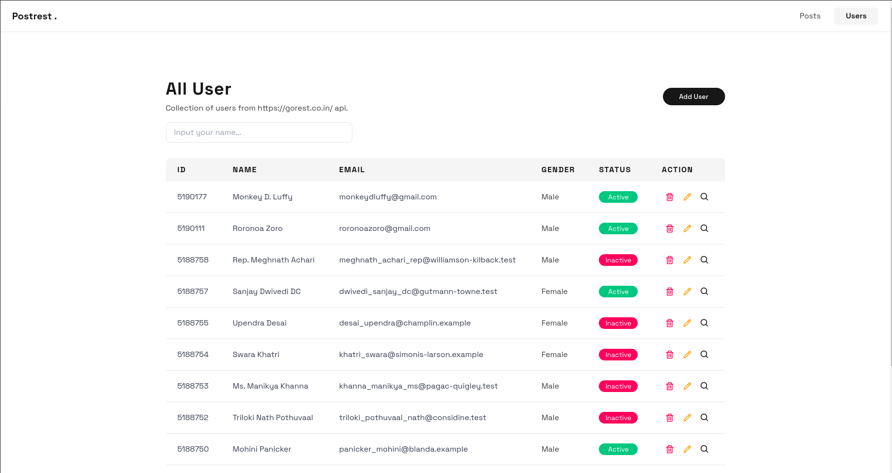

# Postrest

Postrest site - Integrate with [Go Rest](https://gorest.co.in/) api

## Preview





## Tech Stack

- Next Js + Typescript (Frontend Library)
- Redux Toolkit (State Management Library)
- React Query + Axios (Fetch Library)
- TailwindCSS (CSS Library)
- React Hook Form + Yup (Validation Library)
- Eslint + Prettier (Code Formatter Library)

## Run Locally

Clone this repository.

```bash
  git clone git@github.com:nzrmm/postrest.git
```

Copy `.env.example` to `.env.local` and replace `NEXT_PUBLIC_API_KEY` with your access token from [Go Rest](https://gorest.co.in/) site.

- My access token: `a53f0ab8f34488965b801969699b5884e402cc15bb279b626ea72ff820425887`

```bash
NEXT_PUBLIC_API_URL=https://gorest.co.in/public/v2
NEXT_PUBLIC_API_KEY="GOREST_API_KEY"
```

Install dependencies.

```bash
  yarn
```

Run development server

```bash
  yarn dev
```
